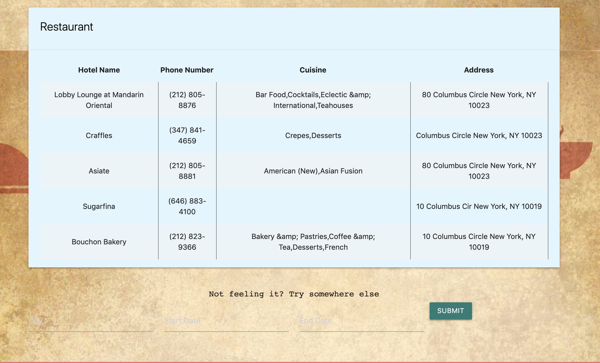

# tripr
This is the link to the live site

https://tripr-project.github.io/tripr/

On this site we aim to help users find hotels, around a provided location. In addition, we provide an input form of an arrival and departure date to display a few hotels with availabilities for the provided dates.

Along with this, we also display restaurants in the surrounding areas.

In order to improve future functionality of this website we would like to create a better input form, better display of results, and capable of displaying additional results. We would also like to add more detailed results on the demand of both the restaurants and hotels.

A Screenshots of website after entering "New York City"

The images displayed:

The table of restaurants displayed:

